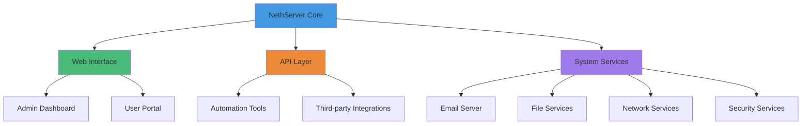
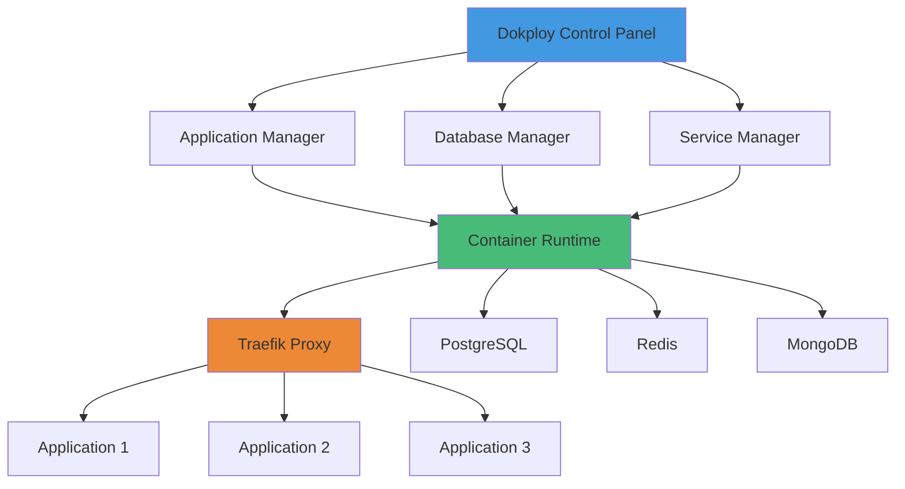
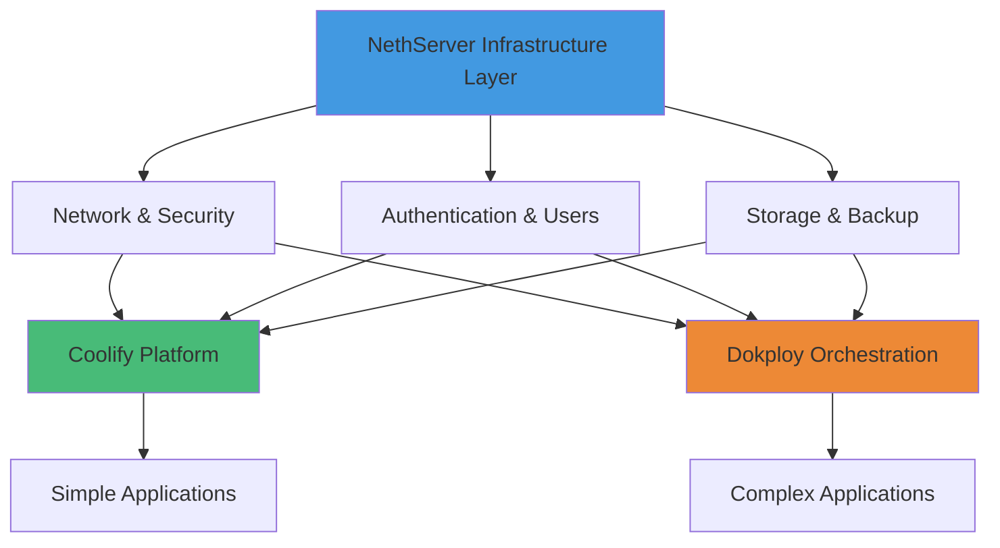

<div class="absolute top-8 left-8 flex items-center gap-3">
  <div class="text-left">
    <div class="text-sm font-semibold text-blue-400">Africa DevOps Summit</div>
    <div class="text-xs opacity-60">Nairobi DevOps Community</div>
  </div>
</div>

<div class="absolute top-8 right-8 flex gap-3 text-lg opacity-60">
  <carbon-logo-twitter />
  <carbon-logo-github />
  <carbon-logo-linkedin />
</div>

<div class="h-full flex flex-col items-center justify-center">
  <h1 class="text-5xl font-bold mb-6">
    Data Sovereignty Through<br/>Open Source Infrastructure
  </h1>
  
  <p class="text-2xl opacity-80 mb-12">
    Reclaiming Control in the DevOps Era
  </p>
  
  <div class="space-y-3">
    <div class="text-xl font-semibold text-blue-400">Martin Bhoung</div>
    <div class="text-sm opacity-70">Lead Presenter</div>
    <div class="text-xl font-semibold text-green-400 mt-4">Kemboi Elvis</div>
    <div class="text-sm opacity-70">Co-Presenter</div>
  </div>
</div>

---

<div class="h-full flex flex-col items-center justify-center px-20">
  <h1 class="text-4xl font-bold mb-16">About the Presenters</h1>
  
  <div class="grid grid-cols-2 gap-16 w-full max-w-5xl">
    <div class="space-y-4">
      <h2 class="text-3xl font-bold text-blue-400">Martin Bhoung</h2>
      <p class="text-lg opacity-90">Lead Presenter</p>
      <p class="text-base opacity-80 leading-relaxed">
        Technocrat and entrepreneur with over a decade of expertise in infrastructure architecture, business automation, and enterprise systems. Passionate about data sovereignty and building resilient self-hosted solutions for Africa.
      </p>
      <div class="space-y-2 text-sm pt-4">
        <div class="flex items-center gap-2">
          <carbon-logo-github class="text-base" />
          <span>github.com/compgeniuses</span>
        </div>
        <div class="flex items-center gap-2">
          <carbon-logo-twitter class="text-base" />
          <span>@oneitonitram</span>
        </div>
        <div class="flex items-center gap-2">
          <carbon-email class="text-base" />
          <span>martin@genius.ke</span>
        </div>
      </div>
    </div>
    <div class="space-y-4">
      <h2 class="text-3xl font-bold text-green-400">Kemboi Elvis</h2>
      <p class="text-lg opacity-90">Co-Presenter</p>
      <p class="text-base opacity-80 leading-relaxed">
        DevOps engineer specializing in cloud and self-hosted solutions, automation, and CI/CD pipelines. Committed to building sustainable infrastructure and empowering African tech communities through knowledge sharing.
      </p>
      <div class="space-y-2 text-sm pt-4">
        <div class="flex items-center gap-2">
          <carbon-logo-github class="text-base" />
          <span>github.com/kemboi22</span>
        </div>
        <div class="flex items-center gap-2">
          <carbon-logo-twitter class="text-base" />
          <span>@kemboielvis22</span>
        </div>
        <div class="flex items-center gap-2">
          <carbon-email class="text-base" />
          <span>kemboielvis@genius.ke</span>
        </div>
      </div>
    </div>
  </div>
</div>

---

<div class="h-full flex flex-col items-center justify-center">
  <div class="text-6xl mb-8">🔨</div>
  <h1 class="text-4xl font-bold mb-6 text-transparent bg-clip-text bg-gradient-to-r from-blue-400 to-green-400">
    We Practice What We Preach
  </h1>
  
  <p class="text-2xl opacity-80 mb-8">
    Genius Forge Platform
  </p>
  
  <a href="https://forge.genius.ke/" target="_blank" 
     class="text-3xl text-blue-400 hover:text-blue-300 font-mono mb-12">
    forge.genius.ke
  </a>
  
  <p class="text-base opacity-70 max-w-2xl text-center mb-8">
    A production-grade infrastructure built with the exact tools we're discussing today. Running on self-hosted infrastructure in Africa, serving thousands of users with complete data sovereignty.
  </p>
  
  <div class="grid grid-cols-3 gap-8 max-w-3xl">
    <div class="text-center p-6 bg-blue-500/10 rounded-lg">
      <div class="text-4xl mb-3">⚡</div>
      <div class="font-bold text-lg">Lightning Fast</div>
      <div class="text-sm opacity-70 mt-2">Hosted on African soil</div>
    </div>
    <div class="text-center p-6 bg-green-500/10 rounded-lg">
      <div class="text-4xl mb-3">🔒</div>
      <div class="font-bold text-lg">100% Sovereign</div>
      <div class="text-sm opacity-70 mt-2">We control our data</div>
    </div>
    <div class="text-center p-6 bg-purple-500/10 rounded-lg">
      <div class="text-4xl mb-3">🚀</div>
      <div class="font-bold text-lg">Always Available</div>
      <div class="text-sm opacity-70 mt-2">99.9% uptime</div>
    </div>
  </div>
</div>

---

<div class="h-full flex flex-col items-center justify-center">
  <h1 class="text-5xl font-bold mb-8 text-red-400">The Problem</h1>
  <p class="text-3xl opacity-90 mb-12">Your data is not yours</p>
  <p class="text-xl opacity-70 max-w-2xl text-center">
    When you rely on proprietary cloud platforms, you surrender control over your most valuable asset: your data. You become subject to their terms, their pricing changes, their security breaches, and their business decisions.
  </p>
</div>

---

<div class="px-20 py-16">
  <h1 class="text-4xl font-bold mb-12">The Cloud Paradox</h1>
  
  <div class="grid grid-cols-2 gap-16">
    <div>
      <h2 class="text-2xl font-bold mb-6 text-green-400">What We Gained</h2>
      <ul class="space-y-3 text-lg">
        <li class="flex items-start gap-3">
          <span class="text-green-400 mt-1">✓</span>
          <span>Scalability on demand</span>
        </li>
        <li class="flex items-start gap-3">
          <span class="text-green-400 mt-1">✓</span>
          <span>Global distribution</span>
        </li>
        <li class="flex items-start gap-3">
          <span class="text-green-400 mt-1">✓</span>
          <span>Managed services</span>
        </li>
        <li class="flex items-start gap-3">
          <span class="text-green-400 mt-1">✓</span>
          <span>DevOps velocity</span>
        </li>
      </ul>
    </div>
    <div>
      <h2 class="text-2xl font-bold mb-6 text-red-400">What We Lost</h2>
      <ul class="space-y-3 text-lg">
        <li class="flex items-start gap-3">
          <span class="text-red-400 mt-1">✗</span>
          <span>Data ownership</span>
        </li>
        <li class="flex items-start gap-3">
          <span class="text-red-400 mt-1">✗</span>
          <span>Privacy guarantees</span>
        </li>
        <li class="flex items-start gap-3">
          <span class="text-red-400 mt-1">✗</span>
          <span>Cost predictability</span>
        </li>
        <li class="flex items-start gap-3">
          <span class="text-red-400 mt-1">✗</span>
          <span>Vendor independence</span>
        </li>
        <li class="flex items-start gap-3">
          <span class="text-red-400 mt-1">✗</span>
          <span>Regulatory compliance</span>
        </li>
        <li class="flex items-start gap-3">
          <span class="text-red-400 mt-1">✗</span>
          <span>True control</span>
        </li>
      </ul>
    </div>
  </div>
</div>

---

<div class="h-full flex flex-col items-center justify-center">
  <h1 class="text-5xl font-bold mb-8">Data Sovereignty</h1>
  <p class="text-2xl opacity-80">Your data. Your infrastructure. Your rules.</p>
</div>

---

<div class="px-20 py-16">
  <h1 class="text-4xl font-bold mb-8">What is Data Sovereignty?</h1>
  
  <p class="text-lg opacity-90 mb-8 max-w-4xl">
    Data sovereignty is the concept that digital information is subject to the laws and governance structures of the nation where it is stored or processed. It represents the principle that organizations and individuals should have complete control over their data, including where it lives and who can access it.
  </p>
  
  <h2 class="text-2xl font-bold mb-6 mt-12">Why It Matters</h2>
  
  <div class="grid grid-cols-2 gap-8 max-w-5xl">
    <div class="space-y-4">
      <div class="p-4 bg-blue-500/10 rounded">
        <h3 class="font-bold text-lg mb-2">Legal Compliance</h3>
        <p class="text-sm opacity-80">GDPR, African Union Convention on Cyber Security, and local data protection laws require data localization for many use cases.</p>
      </div>
      <div class="p-4 bg-green-500/10 rounded">
        <h3 class="font-bold text-lg mb-2">National Security</h3>
        <p class="text-sm opacity-80">Sensitive government and corporate data must stay within national borders to prevent foreign surveillance and espionage.</p>
      </div>
      <div class="p-4 bg-purple-500/10 rounded">
        <h3 class="font-bold text-lg mb-2">Economic Control</h3>
        <p class="text-sm opacity-80">Reduce dependency on foreign tech giants and keep economic value within local economies.</p>
      </div>
    </div>
    <div class="space-y-4">
      <div class="p-4 bg-orange-500/10 rounded">
        <h3 class="font-bold text-lg mb-2">Digital Independence</h3>
        <p class="text-sm opacity-80">Build local capabilities and expertise rather than outsourcing critical infrastructure to foreign entities.</p>
      </div>
      <div class="p-4 bg-red-500/10 rounded">
        <h3 class="font-bold text-lg mb-2">Trust & Transparency</h3>
        <p class="text-sm opacity-80">Know exactly where your data lives, who has access to it, and how it's being protected.</p>
      </div>
    </div>
  </div>
</div>

---

<div class="h-full flex flex-col items-center justify-center">
  <h1 class="text-4xl font-bold mb-12">The Open Source Solution</h1>
  
  <div class="grid grid-cols-3 gap-12 max-w-5xl">
    <div class="text-center p-8 bg-blue-500/10 rounded-xl">
      <div class="text-6xl mb-6">🔓</div>
      <h3 class="text-2xl font-bold mb-3">Freedom</h3>
      <p class="text-base opacity-80">No vendor lock-in. Switch providers, modify code, or migrate anytime without restrictions.</p>
    </div>
    <div class="text-center p-8 bg-green-500/10 rounded-xl">
      <div class="text-6xl mb-6">👁️</div>
      <h3 class="text-2xl font-bold mb-3">Transparency</h3>
      <p class="text-base opacity-80">Inspect every line of code. Know exactly what's running on your infrastructure.</p>
    </div>
    <div class="text-center p-8 bg-purple-500/10 rounded-xl">
      <div class="text-6xl mb-6">🛡️</div>
      <h3 class="text-2xl font-bold mb-3">Security</h3>
      <p class="text-base opacity-80">Community audited by thousands of developers. Vulnerabilities are found and fixed faster.</p>
    </div>
  </div>
</div>

---

<div class="px-20 overflow-y-auto">
  <h1 class="text-4xl font-bold mb-12">Introducing Our Stack</h1>
  
  <div class="space-y-2 max-w-4xl">
    <div class="p-2 bg-blue-500/10 rounded-lg">
      <h2 class="text-2xl font-bold mb-3 text-blue-400">NethServer</h2>
      <p class="text-base opacity-90">Complete Infrastructure Foundation</p>
      <p class="text-sm opacity-70 mt-2">
        The Swiss Army knife of self-hosted infrastructure. Handles email, networking, security, file services, and more. Built on Rocky Linux for enterprise-grade stability.
      </p>
    </div>
    <div class="p-2 bg-green-500/10 rounded-lg">
      <h2 class="text-2xl font-bold mb-3 text-green-400">Coolify</h2>
      <p class="text-base opacity-90">The Open Source Heroku Alternative</p>
      <p class="text-sm opacity-70 mt-2">
        Deploy applications with the simplicity of platform-as-a-service while maintaining complete control. Git push deployments, automatic SSL, and zero-downtime updates.
      </p>
    </div>
    <div class="p-2 bg-purple-500/10 rounded-lg">
      <h2 class="text-2xl font-bold mb-3 text-purple-400">Dokploy</h2>
      <p class="text-base opacity-90">Container Orchestration Made Simple</p>
      <p class="text-sm opacity-70 mt-2">
        Kubernetes-like power without the complexity overhead. Perfect for teams who need container orchestration but aren't ready for full Kubernetes.
      </p>
    </div>
  </div>
</div>

---

<div class="h-full flex items-center justify-center">
  <div>
    <h1 class="text-5xl font-bold mb-6">Part 1: NethServer</h1>
    <p class="text-2xl opacity-80">Your Infrastructure, Unified</p>
  </div>
</div>

---

<div class="px-20 py-16">
  <h1 class="text-4xl font-bold mb-8">What is NethServer?</h1>
  
  <p class="text-lg opacity-90 mb-8 max-w-4xl leading-relaxed">
    NethServer is a comprehensive, open-source operating system designed for servers that brings enterprise-grade features to self-hosted infrastructure. It transforms complex server management into an intuitive experience while maintaining the power and flexibility that advanced users demand.
  </p>
  
  <div class="grid grid-cols-2 gap-12 mt-12">
    <div>
      <h2 class="text-2xl font-bold mb-4 text-blue-400">Built on Rocky Linux</h2>
      <ul class="space-y-3 text-base opacity-80">
        <li>• Stable, enterprise-ready foundation</li>
        <li>• Long-term support and security updates</li>
        <li>• RHEL ecosystem compatibility</li>
        <li>• Battle-tested in production environments</li>
      </ul>
    </div>
    <div>
      <h2 class="text-2xl font-bold mb-4 text-green-400">Key Philosophy</h2>
      <p class="text-base opacity-80 leading-relaxed">
        Simplicity meets power. NethServer provides complex infrastructure management through an intuitive web interface without sacrificing advanced capabilities. Whether you're a small business or an enterprise, NethServer scales to meet your needs.
      </p>
    </div>
  </div>
</div>

---

<div class="px-20 py-16">
  <h1 class="text-4xl font-bold mb-12">NethServer Core Capabilities</h1>
  
  <div class="grid grid-cols-2 gap-8">
    <div class="space-y-4">
      <div class="p-6 bg-blue-500/10 rounded-lg">
        <h3 class="text-xl font-bold mb-3 flex items-center gap-2">
          <span class="text-2xl">📧</span>
          Email & Collaboration
        </h3>
        <ul class="text-sm opacity-80 space-y-1">
          <li>• Full mail server with SMTP, IMAP, POP3</li>
          <li>• Webmail interface for remote access</li>
          <li>• Calendar and contacts sync</li>
          <li>• Anti-spam and anti-virus protection</li>
        </ul>
      </div>
      <div class="p-6 bg-green-500/10 rounded-lg">
        <h3 class="text-xl font-bold mb-3 flex items-center gap-2">
          <span class="text-2xl">🌐</span>
          Networking & Gateway
        </h3>
        <ul class="text-sm opacity-80 space-y-1">
          <li>• Advanced firewall with deep packet inspection</li>
          <li>• VPN server supporting OpenVPN and IPsec</li>
          <li>• Web proxy and content filtering</li>
          <li>• Multi-WAN and load balancing</li>
        </ul>
      </div>
    </div>
    <div class="space-y-4">
      <div class="p-6 bg-purple-500/10 rounded-lg">
        <h3 class="text-xl font-bold mb-3 flex items-center gap-2">
          <span class="text-2xl">📁</span>
          File Services
        </h3>
        <ul class="text-sm opacity-80 space-y-1">
          <li>• Samba file sharing for Windows integration</li>
          <li>• Network attached storage capabilities</li>
          <li>• Cloud sync solutions</li>
          <li>• Automated backup and restore</li>
        </ul>
      </div>
      <div class="p-6 bg-orange-500/10 rounded-lg">
        <h3 class="text-xl font-bold mb-3 flex items-center gap-2">
          <span class="text-2xl">🔐</span>
          Authentication & Security
        </h3>
        <ul class="text-sm opacity-80 space-y-1">
          <li>• Active Directory integration</li>
          <li>• LDAP directory services</li>
          <li>• Certificate management with Let's Encrypt</li>
          <li>• Intrusion detection and prevention</li>
        </ul>
      </div>
    </div>
  </div>
</div>

---

<div class="px-20 py-16">
  <h1 class="text-4xl font-bold mb-12">NethServer for DevOps</h1>
  
  <div class="space-y-8 max-w-5xl">
    <div class="p-6 bg-blue-500/5 border-l-4 border-blue-400">
      <h3 class="text-xl font-bold mb-3">Unified Management Interface</h3>
      <p class="text-base opacity-80">
        Manage your entire infrastructure from a single, intuitive dashboard. No more jumping between dozens of tools and configuration files. Everything you need is accessible from one place with a consistent user experience.
      </p>
    </div>
    <div class="p-6 bg-green-500/5 border-l-4 border-green-400">
      <h3 class="text-xl font-bold mb-3">Automation-Ready</h3>
      <p class="text-base opacity-80">
        Built with automation in mind from the ground up. Full API access allows you to integrate with your CI/CD pipelines. Compatible with configuration management tools like Ansible, Puppet, and Salt. Scriptable deployments make infrastructure as code a reality.
      </p>
    </div>
    <div class="p-6 bg-purple-500/5 border-l-4 border-purple-400">
      <h3 class="text-xl font-bold mb-3">Self-Service Infrastructure</h3>
      <p class="text-base opacity-80">
        Developers can provision resources without waiting for operations teams, yet proper governance and security controls remain built-in. Role-based access control ensures that teams have the access they need without compromising security.
      </p>
    </div>
    <div class="p-6 bg-orange-500/5 border-l-4 border-orange-400">
      <h3 class="text-xl font-bold mb-3">Monitoring & Observability</h3>
      <p class="text-base opacity-80">
        Integrated monitoring, logging, and alerting keep your finger on the pulse of your infrastructure. Real-time dashboards show system health at a glance. Detailed logs help troubleshoot issues quickly when they arise.
      </p>
    </div>
  </div>
</div>

---

<div class="px-20 py-12">
  <h1 class="text-4xl font-bold mb-8">NethServer Architecture</h1>
  
  <div class="flex items-center justify-center scale-[2.5] pt-20">
    


  </div>
</div>

---

<div class="px-20 py-16">
  <h1 class="text-4xl font-bold mb-8">Real-World NethServer Use Case</h1>
  
  <div class="mb-8">
    <h2 class="text-2xl font-bold mb-4 text-blue-400">Scenario: African FinTech Startup</h2>
    <p class="text-lg opacity-90 mb-6">
      A growing financial technology company needs to handle sensitive financial data with strict data residency requirements while maintaining the agility that DevOps practices provide.
    </p>
  </div>
  
  <div class="grid grid-cols-2 gap-12">
    <div>
      <h3 class="text-xl font-bold mb-4 text-red-400">The Challenge</h3>
      <ul class="space-y-2 text-base opacity-80">
        <li>• Customer financial data must stay in-country</li>
        <li>• Need PCI-DSS compliance for payment processing</li>
        <li>• Remote team requires secure access</li>
        <li>• Limited budget for infrastructure</li>
        <li>• Must maintain high availability</li>
      </ul>
    </div>
    <div>
      <h3 class="text-xl font-bold mb-4 text-green-400">Solution with NethServer</h3>
      <ul class="space-y-2 text-base opacity-80">
        <li>• Email infrastructure for secure communications and audit trails</li>
        <li>• VPN gateway for secure remote team access</li>
        <li>• File services for encrypted document storage</li>
        <li>• Firewall with PCI-DSS compliant network segmentation</li>
        <li>• Automated encrypted backups to local storage</li>
      </ul>
    </div>
  </div>
  
  <div class="mt-8 p-6 bg-green-500/10 rounded-lg">
    <h3 class="text-xl font-bold mb-2">Result</h3>
    <p class="text-base opacity-90">
      Complete control over data with regulatory compliance achieved. Infrastructure costs reduced by seventy percent compared to managed cloud services. Team productivity increased through self-service capabilities and automated workflows.
    </p>
  </div>
</div>

---

<div class="h-full flex items-center justify-center">
  <div>
    <h1 class="text-5xl font-bold mb-6">Part 2: Coolify</h1>
    <p class="text-2xl opacity-80">Deploy Like Heroku, Own Like Self-Hosted</p>
  </div>
</div>

---

<div class="px-20 py-16">
  <h1 class="text-4xl font-bold mb-8">What is Coolify?</h1>
  
  <p class="text-lg opacity-90 mb-12 max-w-4xl leading-relaxed">
    Coolify is an open-source, self-hostable alternative to Heroku, Netlify, and Vercel. It's designed to make deploying applications as simple as pushing to git, while keeping everything on your own infrastructure. You get the platform-as-a-service experience without surrendering control of your data or being locked into a vendor.
  </p>
  
  <div class="grid grid-cols-2 gap-12">
    <div>
      <h2 class="text-2xl font-bold mb-4 text-blue-400">The PaaS Experience</h2>
      <ul class="space-y-3 text-base opacity-80">
        <li>• Git push deployments that just work</li>
        <li>• Automatic SSL certificates with Let's Encrypt</li>
        <li>• Built-in monitoring and health checks</li>
        <li>• Zero-downtime deployments</li>
        <li>• Preview environments for pull requests</li>
      </ul>
    </div>
    <div>
      <h2 class="text-2xl font-bold mb-4 text-green-400">The Self-Hosted Advantage</h2>
      <ul class="space-y-3 text-base opacity-80">
        <li>• Your servers, your data, your control</li>
        <li>• No usage limits or pricing tiers</li>
        <li>• Full customization of every aspect</li>
        <li>• Complete privacy and data sovereignty</li>
        <li>• No vendor lock-in or migration headaches</li>
      </ul>
    </div>
  </div>
</div>

---

<div class="px-20 py-16">
  <h1 class="text-4xl font-bold mb-12">Coolify Features</h1>
  
  <div class="grid grid-cols-2 gap-8">
    <div class="space-y-6">
      <div class="p-6 bg-blue-500/10 rounded-lg">
        <h3 class="text-xl font-bold mb-3 flex items-center gap-2">
          <span class="text-2xl">🚀</span>
          Multiple Frameworks
        </h3>
        <p class="text-sm opacity-80">
          Supports Node.js, Python, PHP, Ruby, Go, and more. Deploy static sites built with React, Vue, Next.js, or any modern framework. Even run custom Docker containers or full compose files for complex applications.
        </p>
      </div>
      <div class="p-6 bg-green-500/10 rounded-lg">
        <h3 class="text-xl font-bold mb-3 flex items-center gap-2">
          <span class="text-2xl">🔄</span>
          CI/CD Pipeline
        </h3>
        <p class="text-sm opacity-80">
          Seamless integration with GitHub, GitLab, and Bitbucket. Every push triggers automatic builds and deployments. Create preview environments for every pull request. Rollback to any previous version with a single click.
        </p>
      </div>
    </div>
    <div class="space-y-6">
      <div class="p-6 bg-purple-500/10 rounded-lg">
        <h3 class="text-xl font-bold mb-3 flex items-center gap-2">
          <span class="text-2xl">💾</span>
          Database Management
        </h3>
        <p class="text-sm opacity-80">
          One-click deployment of PostgreSQL, MySQL, MongoDB, Redis, and MariaDB. Automated backups ensure your data is never lost. Point-in-time recovery makes disaster recovery straightforward.
        </p>
      </div>
      <div class="p-6 bg-orange-500/10 rounded-lg">
        <h3 class="text-xl font-bold mb-3 flex items-center gap-2">
          <span class="text-2xl">🌍</span>
          Global Deployment
        </h3>
        <p class="text-sm opacity-80">
          Deploy to multiple servers across different regions. Built-in load balancing distributes traffic intelligently. CDN integration accelerates content delivery. Edge deployment brings your apps closer to users.
        </p>
      </div>
    </div>
  </div>
</div>

---

<div class="px-20 py-12">
<h1 class="text-4xl font-bold mb-8">Coolify Architecture</h1>
<p>Architecture diagram here</p>
</div>

---

<div class="px-20 py-16">
  <h1 class="text-4xl font-bold mb-12">Setting Up Coolify</h1>
  
  <div class="space-y-8">
    <div class="p-6 bg-blue-500/5 border-l-4 border-blue-400">
      <h3 class="text-xl font-bold mb-2">Step 1: Prerequisites</h3>
      <p class="text-base opacity-80">
        You need a server with Docker installed. Any Linux distribution works, though Ubuntu and Debian are most common. Minimum requirements are two gigabytes of RAM and two CPU cores, but four gigabytes of RAM is recommended for production workloads.
      </p>
    </div>
    <div class="p-6 bg-green-500/5 border-l-4 border-green-400">
      <h3 class="text-xl font-bold mb-3">Step 2: One-Line Install</h3>
      <p class="text-base opacity-80 mb-3">Run this single command to install Coolify:</p>
      <pre class="bg-gray-800 p-4 rounded text-sm">curl -fsSL https://cdn.coollabs.io/coolify/install.sh | sudo bash</pre>
      <p class="text-sm opacity-70 mt-2">The installer handles all dependencies and configuration automatically.</p>
    </div>
    <div class="p-6 bg-purple-500/5 border-l-4 border-purple-400">
      <h3 class="text-xl font-bold mb-2">Step 3: Access Dashboard</h3>
      <p class="text-base opacity-80">
        Navigate to your server's IP address on port eight thousand. Complete the setup wizard by creating an admin account and configuring basic settings. The entire process takes less than five minutes.
      </p>
    </div>
    <div class="p-6 bg-orange-500/5 border-l-4 border-orange-400">
      <h3 class="text-xl font-bold mb-2">Step 4: Connect Git Repository</h3>
      <p class="text-base opacity-80">
        Add your Git provider credentials through the dashboard. Select the repository you want to deploy. Coolify automatically detects the framework, configures the build process, and handles everything else. Your first deployment is just minutes away.
      </p>
    </div>
  </div>
</div>

---

<div class="px-20">
  <h1 class="text-4xl font-bold mb-8">Coolify Deployment Workflow</h1>
  
  <p class="text-base opacity-80 mb-8">
    Here's an example configuration for deploying a Next.js application with Coolify:
  </p>
  
</div>
```yaml
version: '1.0'

services:
web:
build:
context: .
dockerfile: Dockerfile
ports: - "3000:3000"
environment: - NODE_ENV=production - DATABASE_URL=${DATABASE_URL}
healthcheck:
test: ["CMD", "curl", "-f", "http://localhost:3000/api/health"]
interval: 30s
timeout: 10s
retries: 3

databases:
postgres:
image: postgres:15
volumes: - postgres_data:/var/lib/postgresql/data
environment: - POSTGRES_PASSWORD=${DB_PASSWORD}

```

---

<div class="px-20 py-16">
  <h1 class="text-4xl font-bold mb-12">Coolify DevOps Benefits</h1>

  <div class="space-y-6 max-w-5xl">
    <div class="p-6 bg-blue-500/10 rounded-lg">
      <h3 class="text-xl font-bold mb-2">Developer Velocity</h3>
      <p class="text-base opacity-80">
        Developers push code and Coolify handles building, testing, and deploying automatically. No context switching to infrastructure management means developers stay in flow state longer. Faster iterations lead to faster product development.
      </p>
    </div>
    <div class="p-6 bg-green-500/10 rounded-lg">
      <h3 class="text-xl font-bold mb-2">Infrastructure as Code</h3>
      <p class="text-base opacity-80">
        Your deployment configuration lives in your repository alongside your code. It's version controlled, reviewable in pull requests, and auditable. This makes deployments repeatable and predictable across all environments.
      </p>
    </div>
    <div class="p-6 bg-purple-500/10 rounded-lg">
      <h3 class="text-xl font-bold mb-2">Cost Efficiency</h3>
      <p class="text-base opacity-80">
        Run unlimited applications on your infrastructure with no per-app pricing or usage metering. You only pay for the server resources you use. For most teams, this results in dramatic cost savings compared to platform-as-a-service providers.
      </p>
    </div>
    <div class="p-6 bg-orange-500/10 rounded-lg">
      <h3 class="text-xl font-bold mb-2">Team Collaboration</h3>
      <p class="text-base opacity-80">
        Multiple team members can manage deployments with role-based access control ensuring security. Audit logs track every action for accountability. Real-time deployment status keeps everyone informed about what's happening.
      </p>
    </div>
  </div>
</div>

---

<div class="h-full flex items-center justify-center">
  <div>
    <h1 class="text-5xl font-bold mb-6">Part 3: Dokploy</h1>
    <p class="text-2xl opacity-80">Container Orchestration Without the Complexity</p>
  </div>
</div>

---

<div class="px-20 py-16">
  <h1 class="text-4xl font-bold mb-8">What is Dokploy?</h1>

  <p class="text-lg opacity-90 mb-12 max-w-4xl leading-relaxed">
    Dokploy is a modern, self-hosted platform-as-a-service that provides Kubernetes-like orchestration capabilities with dramatically simplified management. It gives you the power of container orchestration without requiring deep expertise in distributed systems.
  </p>

  <div class="space-y-8">
    <div>
      <h2 class="text-2xl font-bold mb-4 text-red-400">The Kubernetes Problem</h2>
      <p class="text-base opacity-80 leading-relaxed">
        Kubernetes is incredibly powerful but notoriously complex. Most teams don't need ninety percent of its features but suffer one hundred percent of its operational overhead. The learning curve is steep, requiring dedicated platform engineers just to keep things running smoothly.
      </p>
    </div>
    <div>
      <h2 class="text-2xl font-bold mb-4 text-green-400">The Dokploy Solution</h2>
      <p class="text-base opacity-80 leading-relaxed">
        Dokploy provides all the container orchestration capabilities you actually need. Multi-container applications, intelligent scaling, service networking, and secrets management are all included. The difference is that Dokploy makes these features accessible through a clean interface and familiar Docker Compose syntax.
      </p>
    </div>
    <div>
      <h2 class="text-2xl font-bold mb-4 text-blue-400">Perfect For</h2>
      <p class="text-base opacity-80 leading-relaxed">
        Teams who want container orchestration but aren't ready for the full Kubernetes experience. Organizations that value simplicity and maintainability over absolute configurability. Projects where developer productivity matters more than supporting every possible edge case.
      </p>
    </div>
  </div>
</div>

---

<div class="px-20 py-16">
  <h1 class="text-4xl font-bold mb-12">Dokploy Core Features</h1>

  <div class="space-y-6 max-w-5xl">
    <div class="p-6 bg-blue-500/10 rounded-lg">
      <h3 class="text-xl font-bold mb-2 flex items-center gap-2">
        <span class="text-2xl">🐳</span>
        Docker Compose Native
      </h3>
      <p class="text-base opacity-80">
        Deploy complex, multi-container applications using the familiar Docker Compose syntax you already know. No need to learn new paradigms or rewrite your existing configurations. If it works with Docker Compose, it works with Dokploy.
      </p>
    </div>
    <div class="p-6 bg-green-500/10 rounded-lg">
      <h3 class="text-xl font-bold mb-2 flex items-center gap-2">
        <span class="text-2xl">🔄</span>
        GitOps Workflow
      </h3>
      <p class="text-base opacity-80">
        Connect your Git repository and Dokploy automatically deploys on every push. Your infrastructure configuration lives in version control alongside your application code. This creates a complete audit trail and makes rollbacks trivial.
      </p>
    </div>
    <div class="p-6 bg-purple-500/10 rounded-lg">
      <h3 class="text-xl font-bold mb-2 flex items-center gap-2">
        <span class="text-2xl">🎯</span>
        Service Discovery
      </h3>
      <p class="text-base opacity-80">
        Containers automatically discover each other through built-in DNS. No manual configuration of service endpoints or IP addresses. The networking just works, allowing you to focus on building features instead of managing infrastructure.
      </p>
    </div>
    <div class="p-6 bg-orange-500/10 rounded-lg">
      <h3 class="text-xl font-bold mb-2 flex items-center gap-2">
        <span class="text-2xl">📊</span>
        Resource Management
      </h3>
      <p class="text-base opacity-80">
        Set resource limits to prevent any single service from monopolizing your infrastructure. Monitor resource usage in real-time through intuitive dashboards. Scale services up or down based on actual demand with simple configuration changes.
      </p>
    </div>
    <div class="p-6 bg-red-500/10 rounded-lg">
      <h3 class="text-xl font-bold mb-2 flex items-center gap-2">
        <span class="text-2xl">🔐</span>
        Secrets Management
      </h3>
      <p class="text-base opacity-80">
        Securely store and inject environment variables, API keys, database credentials, and other sensitive data. Secrets are encrypted at rest and never exposed in logs. Rotate credentials without redeploying applications.
      </p>
    </div>
  </div>
</div>

---

<div class="px-20 py-16">
  <h1 class="text-4xl font-bold mb-12">Dokploy vs Alternatives</h1>

  <div class="grid grid-cols-3 gap-8">
    <div class="p-6 border-2 border-blue-500/50 rounded-lg">
      <h3 class="text-2xl font-bold mb-4 text-blue-400">Docker Compose</h3>
      <div class="mb-6">
        <p class="font-bold text-sm mb-2 text-green-400">Advantages</p>
        <ul class="text-sm opacity-80 space-y-1">
          <li>• Simple and familiar</li>
          <li>• Minimal learning curve</li>
          <li>• Works everywhere</li>
        </ul>
      </div>
      <div>
        <p class="font-bold text-sm mb-2 text-red-400">Limitations</p>
        <ul class="text-sm opacity-80 space-y-1">
          <li>• No web interface</li>
          <li>• Manual scaling required</li>
          <li>• Limited monitoring</li>
          <li>• No built-in GitOps</li>
        </ul>
      </div>
    </div>
    <div class="p-6 border-2 border-green-500/50 rounded-lg bg-green-500/5">
      <h3 class="text-2xl font-bold mb-4 text-green-400">Dokploy</h3>
      <div class="mb-6">
        <p class="font-bold text-sm mb-2 text-green-400">Advantages</p>
        <ul class="text-sm opacity-80 space-y-1">
          <li>• Intuitive web interface</li>
          <li>• Git integration built-in</li>
          <li>• Easy auto-scaling</li>
          <li>• Comprehensive monitoring</li>
          <li>• Simple setup process</li>
        </ul>
      </div>
      <div>
        <p class="font-bold text-sm mb-2 text-red-400">Trade-offs</p>
        <ul class="text-sm opacity-80 space-y-1">
          <li>• Smaller community</li>
          <li>• Fewer integrations</li>
        </ul>
      </div>
    </div>
    <div class="p-6 border-2 border-purple-500/50 rounded-lg">
      <h3 class="text-2xl font-bold mb-4 text-purple-400">Kubernetes</h3>
      <div class="mb-6">
        <p class="font-bold text-sm mb-2 text-green-400">Advantages</p>
        <ul class="text-sm opacity-80 space-y-1">
          <li>• Enterprise-grade</li>
          <li>• Massive ecosystem</li>
          <li>• Ultimate flexibility</li>
        </ul>
      </div>
      <div>
        <p class="font-bold text-sm mb-2 text-red-400">Challenges</p>
        <ul class="text-sm opacity-80 space-y-1">
          <li>• Extremely complex</li>
          <li>• Steep learning curve</li>
          <li>• High operational overhead</li>
          <li>• Requires dedicated team</li>
        </ul>
      </div>
    </div>
  </div>
</div>

---

<div class="px-20 py-12">
  <h1 class="text-4xl font-bold mb-8">Dokploy Architecture</h1>

  <div class="flex items-center justify-center scale-[2] pt-10">



  </div>
</div>

---

<div class="px-20 py-16">
  <h1 class="text-4xl font-bold mb-8">Deploying with Dokploy</h1>
  
  <div class="mb-8">
    <h2 class="text-2xl font-bold mb-4 text-blue-400">Example: Microservices Application</h2>
    <p class="text-base opacity-80 mb-4">Consider a modern application stack with multiple components:</p>
    <ul class="text-base opacity-80 space-y-2">
      <li>• Frontend: React single-page application</li>
      <li>• Backend API: Node.js with Express framework</li>
      <li>• Worker Service: Python for background job processing</li>
      <li>• Database: PostgreSQL for persistent data</li>
      <li>• Cache: Redis for session storage and caching</li>
    </ul>
  </div>
  
  <div class="grid grid-cols-2 gap-8">
    <div>
      <h3 class="text-xl font-bold mb-3 text-red-400">Traditional Approach</h3>
      <p class="text-sm opacity-80">
        Configure Kubernetes manifests, ingress controllers, persistent volumes, services, config maps, and secrets. Write hundreds of lines of YAML spread across dozens of files. Debug cryptic error messages when something inevitably goes wrong.
      </p>
    </div>
    <div>
      <h3 class="text-xl font-bold mb-3 text-green-400">Dokploy Approach</h3>
      <p class="text-sm opacity-80">
        Define your services in a single docker-compose.yml file using familiar syntax. Push to Git. Dokploy automatically builds containers, configures networking, provisions databases, and manages everything else. Deploy in minutes, not days.
      </p>
    </div>
  </div>
</div>

---

<div class="px-20 scale-[0.5]">
  <h1 class="text-4xl font-bold mb-8">Dokploy Configuration Example</h1>
</div>
```yaml
version: '3.8'

services:
frontend:
image: myapp/web:latest
labels: - "traefik.enable=true" - "traefik.http.routers.frontend.rule=Host(`app.example.com`)"
environment: - API_URL=${API_URL}
deploy:
replicas: 3
resources:
limits:
memory: 512M

backend:
image: myapp/api:latest
labels: - "traefik.enable=true" - "traefik.http.routers.api.rule=Host(`api.example.com`)"
environment: - DATABASE_URL=${DATABASE_URL}
      - REDIS_URL=${REDIS_URL}
deploy:
replicas: 2

worker:
image: myapp/worker:latest
environment: - QUEUE_URL=${REDIS_URL}
deploy:
replicas: 1

postgres:
image: postgres:15
volumes: - postgres_data:/var/lib/postgresql/data
environment: - POSTGRES_PASSWORD=${DB_PASSWORD}

redis:
image: redis:7-alpine
volumes: - redis_data:/data

volumes:
postgres_data:
redis_data:
```

---

<div class="px-20 py-16">
  <h1 class="text-4xl font-bold mb-12">Dokploy DevOps Workflow</h1>
  
  <div class="space-y-8 max-w-5xl">
    <div class="flex items-start gap-6">
      <div class="text-4xl font-bold text-blue-400 w-16">1</div>
      <div>
        <h3 class="text-xl font-bold mb-2">Development</h3>
        <p class="text-base opacity-80">
          Developers write code and docker-compose configuration locally. Test the entire stack with a simple 'docker-compose up' command. Fix issues early when they're easiest to resolve.
        </p>
      </div>
    </div>
    <div class="flex items-start gap-6">
      <div class="text-4xl font-bold text-green-400 w-16">2</div>
      <div>
        <h3 class="text-xl font-bold mb-2">Version Control</h3>
        <p class="text-base opacity-80">
          Push code and infrastructure configuration to your Git repository. Infrastructure and application code live together, ensuring they stay in sync. Every change is tracked and auditable.
        </p>
      </div>
    </div>
    <div class="flex items-start gap-6">
      <div class="text-4xl font-bold text-purple-400 w-16">3</div>
      <div>
        <h3 class="text-xl font-bold mb-2">Automated Deployment</h3>
        <p class="text-base opacity-80">
          Dokploy detects changes in your repository, builds containers automatically, and deploys across your infrastructure. No manual intervention required. No opportunity for human error.
        </p>
      </div>
    </div>
    <div class="flex items-start gap-6">
      <div class="text-4xl font-bold text-orange-400 w-16">4</div>
      <div>
        <h3 class="text-xl font-bold mb-2">Monitoring & Scaling</h3>
        <p class="text-base opacity-80">
          Monitor resource usage through the intuitive dashboard. Scale services with a simple slider or configure auto-scaling rules based on metrics. React to traffic patterns in real-time.
        </p>
      </div>
    </div>
    <div class="flex items-start gap-6">
      <div class="text-4xl font-bold text-red-400 w-16">5</div>
      <div>
        <h3 class="text-xl font-bold mb-2">Updates & Rollbacks</h3>
        <p class="text-base opacity-80">
          Deploy new versions with zero downtime using rolling updates. If issues arise, rollback to previous versions instantly with a single click. Sleep better knowing recovery is always one click away.
        </p>
      </div>
    </div>
  </div>
</div>

---

<div class="h-full flex flex-col items-center justify-center px-20">
  <h1 class="text-4xl font-bold mb-12">Bringing It All Together</h1>
  <p class="text-2xl opacity-80">The Complete Self-Hosted DevOps Stack</p>
</div>

---

<div class="px-20 py-16">
  <h1 class="text-4xl font-bold mb-12">The Three-Tier Architecture</h1>
  
  <div class="space-y-8 max-w-5xl">
    <div class="p-8 bg-blue-500/10 rounded-lg border-l-4 border-blue-400">
      <div class="flex items-center gap-4 mb-4">
        <div class="text-3xl font-bold text-blue-400">Tier 1</div>
        <h3 class="text-2xl font-bold">Foundation - NethServer</h3>
      </div>
      <p class="text-base opacity-90">
        Handles your foundational infrastructure needs including networking, email, file services, security, and VPN access. This is the bedrock of your self-hosted environment, providing enterprise-grade services that every organization needs.
      </p>
    </div>
    <div class="p-8 bg-green-500/10 rounded-lg border-l-4 border-green-400">
      <div class="flex items-center gap-4 mb-4">
        <div class="text-3xl font-bold text-green-400">Tier 2</div>
        <h3 class="text-2xl font-bold">Platform - Coolify</h3>
      </div>
      <p class="text-base opacity-90">
        Provides the platform-as-a-service experience for deploying individual applications quickly and easily. Perfect for MVPs, side projects, rapid experimentation, and any application that doesn't require complex orchestration.
      </p>
    </div>
    <div class="p-8 bg-purple-500/10 rounded-lg border-l-4 border-purple-400">
      <div class="flex items-center gap-4 mb-4">
        <div class="text-3xl font-bold text-purple-400">Tier 3</div>
        <h3 class="text-2xl font-bold">Orchestration - Dokploy</h3>
      </div>
      <p class="text-base opacity-90">
        Manages complex, multi-service applications with sophisticated container orchestration. Ideal for production workloads, microservices architectures, and applications that require advanced features like auto-scaling and service mesh capabilities.
      </p>
    </div>
  </div>
</div>

---

<div class="px-20 py-12">
  <h1 class="text-4xl font-bold mb-8">Integration Architecture</h1>
  
  <div class="flex items-center justify-center">
    


  </div>
</div>

---

<div class="px-20 py-16">
  <h1 class="text-4xl font-bold mb-8">Real-World Implementation</h1>
  
  <div class="mb-8">
    <h2 class="text-2xl font-bold mb-4 text-blue-400">Case Study: E-Commerce Platform for Africa</h2>
  </div>
  
  <div class="grid grid-cols-2 gap-12 mb-8">
    <div>
      <h3 class="text-xl font-bold mb-4 text-purple-400">Requirements</h3>
      <ul class="space-y-2 text-base opacity-80">
        <li>• Customer-facing website</li>
        <li>• Admin dashboard for inventory</li>
        <li>• Mobile API backend</li>
        <li>• Payment processing service</li>
        <li>• Inventory management system</li>
        <li>• Data must stay in-country for compliance</li>
      </ul>
    </div>
    <div>
      <h3 class="text-xl font-bold mb-4 text-green-400">Infrastructure Solution</h3>
      <ul class="space-y-2 text-base opacity-80">
        <li><strong>NethServer:</strong> VPN for remote team access</li>
        <li><strong>NethServer:</strong> Email for order notifications</li>
        <li><strong>NethServer:</strong> File storage for product images</li>
        <li><strong>Coolify:</strong> Marketing website and blog</li>
        <li><strong>Coolify:</strong> Static landing pages</li>
        <li><strong>Dokploy:</strong> Core e-commerce microservices</li>
      </ul>
    </div>
  </div>
  
  <div class="p-6 bg-green-500/10 rounded-lg">
    <h3 class="text-xl font-bold mb-3">Outcome</h3>
    <p class="text-base opacity-90">
      Complete data sovereignty achieved with all customer data stored locally. Infrastructure costs reduced by seventy-three percent compared to equivalent cloud services. Team can deploy updates multiple times per day. Regulatory compliance requirements easily met with full audit trails.
    </p>
  </div>
</div>

---

<div class="px-20 py-16">
  <h1 class="text-4xl font-bold mb-12">Cost Comparison</h1>
  
  <div class="grid grid-cols-2 gap-12 mb-8">
    <div class="p-8 bg-red-500/10 rounded-lg">
      <h3 class="text-2xl font-bold mb-6 text-red-400">Cloud Provider Stack</h3>
      <div class="space-y-3 text-base">
        <div class="flex justify-between">
          <span>Managed Kubernetes</span>
          <span class="font-mono">$200/mo</span>
        </div>
        <div class="flex justify-between">
          <span>Database Services</span>
          <span class="font-mono">$150/mo</span>
        </div>
        <div class="flex justify-between">
          <span>Load Balancers</span>
          <span class="font-mono">$50/mo</span>
        </div>
        <div class="flex justify-between">
          <span>Storage</span>
          <span class="font-mono">$100/mo</span>
        </div>
        <div class="flex justify-between">
          <span>Email Service</span>
          <span class="font-mono">$40/mo</span>
        </div>
        <div class="flex justify-between">
          <span>VPN Service</span>
          <span class="font-mono">$30/mo</span>
        </div>
        <div class="border-t border-red-400/30 pt-3 mt-4">
          <div class="flex justify-between font-bold text-lg">
            <span>Monthly Total</span>
            <span class="text-red-400">$570</span>
          </div>
          <div class="flex justify-between font-bold text-xl mt-2">
            <span>Annual Cost</span>
            <span class="text-red-400">$6,840</span>
          </div>
        </div>
      </div>
    </div>
    <div class="p-8 bg-green-500/10 rounded-lg">
      <h3 class="text-2xl font-bold mb-6 text-green-400">Self-Hosted Stack</h3>
      <div class="space-y-3 text-base">
        <div class="flex justify-between">
          <span>Dedicated Server</span>
          <span class="font-mono">$120/mo</span>
        </div>
        <div class="flex justify-between">
          <span>Backup Storage</span>
          <span class="font-mono">$30/mo</span>
        </div>
        <div class="flex justify-between">
          <span>Domain & SSL</span>
          <span class="font-mono">$5/mo</span>
        </div>
        <div class="flex justify-between">
          <span>Monitoring</span>
          <span class="font-mono">$0</span>
        </div>
        <div class="border-t border-green-400/30 pt-3 mt-4">
          <div class="flex justify-between font-bold text-lg">
            <span>Monthly Total</span>
            <span class="text-green-400">$155</span>
          </div>
          <div class="flex justify-between font-bold text-xl mt-2">
            <span>Annual Cost</span>
            <span class="text-green-400">$1,860</span>
          </div>
        </div>
      </div>
    </div>
  </div>
  
  <div class="p-6 bg-green-500/20 rounded-lg text-center">
    <div class="text-3xl font-bold text-green-400 mb-2">73% Cost Savings</div>
    <p class="text-base opacity-90">
      Plus: Complete data sovereignty, no vendor lock-in, unlimited scaling potential, and full control over your infrastructure
    </p>
  </div>
</div>

---

<div class="px-20 py-16">
  <h1 class="text-4xl font-bold mb-12">Security Considerations</h1>
  
  <div class="mb-8">
    <h2 class="text-2xl font-bold mb-6 text-blue-400">Defense in Depth Strategy</h2>
  </div>
  
  <div class="space-y-6 max-w-5xl">
    <div class="p-6 bg-blue-500/10 rounded-lg">
      <h3 class="text-xl font-bold mb-3">Network Layer (NethServer)</h3>
      <p class="text-base opacity-80">
        Advanced firewall rules control all traffic. Intrusion detection systems alert on suspicious activity. VPN encryption protects remote access. Network segmentation isolates sensitive services. DDoS protection prevents service disruption.
      </p>
    </div>
    <div class="p-6 bg-green-500/10 rounded-lg">
      <h3 class="text-xl font-bold mb-3">Application Layer (Coolify/Dokploy)</h3>
      <p class="text-base opacity-80">
        Container isolation prevents lateral movement between services. Least-privilege access ensures services only have permissions they need. Automated security updates patch vulnerabilities quickly. Secrets management keeps credentials encrypted and rotatable.
      </p>
    </div>
    <div class="p-6 bg-purple-500/10 rounded-lg">
      <h3 class="text-xl font-bold mb-3">Data Layer</h3>
      <p class="text-base opacity-80">
        Encryption at rest protects stored data. Encryption in transit secures data moving between services. Automated backups ensure recovery from any disaster. Access logging creates audit trails. Compliance auditing validates security posture regularly.
      </p>
    </div>
    <div class="p-6 bg-orange-500/10 rounded-lg">
      <h3 class="text-xl font-bold mb-3">Best Practices</h3>
      <div class="grid grid-cols-2 gap-4 text-sm opacity-80">
        <div>• Regular security audits</div>
        <div>• Principle of least privilege</div>
        <div>• Multi-factor authentication</div>
        <div>• Automated patching schedules</div>
        <div>• Incident response plans</div>
        <div>• Security awareness training</div>
      </div>
    </div>
  </div>
</div>

---

<div class="px-20 py-16">
  <h1 class="text-4xl font-bold mb-12">Monitoring & Observability</h1>
  
  <div class="space-y-6 max-w-5xl">
    <div class="p-6 bg-blue-500/10 rounded-lg">
      <h3 class="text-xl font-bold mb-3 flex items-center gap-2">
        <span class="text-2xl">🖥️</span>
        Infrastructure Monitoring (NethServer)
      </h3>
      <p class="text-base opacity-80">
        Track system resources including CPU, memory, disk, and network utilization. Monitor service health to detect failures immediately. Analyze security events for potential threats. Generate alerts when thresholds are exceeded.
      </p>
    </div>
    <div class="p-6 bg-green-500/10 rounded-lg">
      <h3 class="text-xl font-bold mb-3 flex items-center gap-2">
        <span class="text-2xl">📱</span>
        Application Monitoring (Coolify)
      </h3>
      <p class="text-base opacity-80">
        Aggregate application logs for troubleshooting. Track deployment history to understand changes. Configure health checks to verify service availability. Monitor performance metrics like response times and error rates.
      </p>
    </div>
    <div class="p-6 bg-purple-500/10 rounded-lg">
      <h3 class="text-xl font-bold mb-3 flex items-center gap-2">
        <span class="text-2xl">🐳</span>
        Container Monitoring (Dokploy)
      </h3>
      <p class="text-base opacity-80">
        Track resource utilization per container. Monitor container health and restart policies. Analyze service mesh metrics for microservices communication. Implement distributed tracing to follow requests across services.
      </p>
    </div>
    <div class="p-6 bg-orange-500/10 rounded-lg">
      <h3 class="text-xl font-bold mb-3 flex items-center gap-2">
        <span class="text-2xl">📊</span>
        Unified Dashboard
      </h3>
      <p class="text-base opacity-80">
        Aggregate metrics from all three layers into a single pane of glass. Use open-source tools like Grafana for visualization and Prometheus for metrics collection. Create custom dashboards tailored to your specific needs and workflows.
      </p>
    </div>
  </div>
</div>

---

<div class="px-20 py-16">
  <h1 class="text-4xl font-bold mb-12">Backup & Disaster Recovery</h1>
  
  <div class="mb-8">
    <h2 class="text-2xl font-bold mb-4 text-blue-400">The 3-2-1 Backup Rule</h2>
    <p class="text-base opacity-80 mb-6">
      A proven strategy that ensures your data survives any disaster scenario.
    </p>
  </div>
  
  <div class="grid grid-cols-3 gap-8 mb-12">
    <div class="text-center p-8 bg-blue-500/10 rounded-lg">
      <div class="text-5xl font-bold text-blue-400 mb-4">3</div>
      <h3 class="text-xl font-bold mb-3">Copies of Data</h3>
      <p class="text-sm opacity-80">
        Maintain three total copies: your original plus two backups. This ensures redundancy even if one backup fails.
      </p>
    </div>
    <div class="text-center p-8 bg-green-500/10 rounded-lg">
      <div class="text-5xl font-bold text-green-400 mb-4">2</div>
      <h3 class="text-xl font-bold mb-3">Different Media</h3>
      <p class="text-sm opacity-80">
        Store backups on two different types of media. For example: disk and tape, or disk and cloud storage.
      </p>
    </div>
    <div class="text-center p-8 bg-purple-500/10 rounded-lg">
      <div class="text-5xl font-bold text-purple-400 mb-4">1</div>
      <h3 class="text-xl font-bold mb-3">Off-Site Copy</h3>
      <p class="text-sm opacity-80">
        Keep one backup off-site to protect against physical disasters like fires, floods, or theft.
      </p>
    </div>
  </div>
  
  <div class="space-y-4 max-w-5xl">
    <div class="p-5 bg-blue-500/5 border-l-4 border-blue-400">
      <h3 class="font-bold mb-2">NethServer Implementation</h3>
      <p class="text-sm opacity-80">Automated backup scheduling with flexible retention policies. Rotation ensures old backups are cleaned up automatically.</p>
    </div>
    <div class="p-5 bg-green-500/5 border-l-4 border-green-400">
      <h3 class="font-bold mb-2">Coolify Implementation</h3>
      <p class="text-sm opacity-80">Git repository backups preserve your code and configuration. Database snapshots capture state at specific points in time.</p>
    </div>
    <div class="p-5 bg-purple-500/5 border-l-4 border-purple-400">
      <h3 class="font-bold mb-2">Dokploy Implementation</h3>
      <p class="text-sm opacity-80">Volume backups protect persistent data. Configuration exports enable infrastructure recreation. Container image registry preserves application versions.</p>
    </div>
  </div>
</div>

---

<div class="px-20 py-16">
  <h1 class="text-4xl font-bold mb-12">Scaling Strategies</h1>
  
  <div class="grid grid-cols-2 gap-12">
    <div>
      <h2 class="text-2xl font-bold mb-6 text-blue-400">Vertical Scaling</h2>
      <div class="mb-6">
        <h3 class="font-bold mb-2">When to Use</h3>
        <p class="text-sm opacity-80">Single application needs more resources. Database performance is bottlenecked by hardware. Simpler than horizontal scaling for initial growth.</p>
      </div>
      <div class="mb-6">
        <h3 class="font-bold mb-2">How to Implement</h3>
        <ul class="text-sm opacity-80 space-y-2">
          <li>• Increase server CPU and memory</li>
          <li>• Optimize database queries and indexes</li>
          <li>• Add caching layers (Redis, Memcached)</li>
          <li>• Upgrade to faster storage (NVMe SSDs)</li>
        </ul>
      </div>
      <div>
        <h3 class="font-bold mb-2">Tools</h3>
        <p class="text-sm opacity-80">NethServer resource allocation dashboard. Container resource limits in Docker. Database performance monitoring and tuning.</p>
      </div>
    </div>
    <div>
      <h2 class="text-2xl font-bold mb-6 text-green-400">Horizontal Scaling</h2>
      <div class="mb-6">
        <h3 class="font-bold mb-2">When to Use</h3>
        <p class="text-sm opacity-80">Need to distribute load across multiple servers. Vertical scaling has reached practical limits. Require high availability and fault tolerance.</p>
      </div>
      <div class="mb-6">
        <h3 class="font-bold mb-2">How to Implement</h3>
        <ul class="text-sm opacity-80 space-y-2">
          <li>• Add more application servers</li>
          <li>• Implement load balancing</li>
          <li>• Distribute services geographically</li>
          <li>• Set up database replication</li>
        </ul>
      </div>
      <div>
        <h3 class="font-bold mb-2">Tools</h3>
        <p class="text-sm opacity-80">Dokploy multi-node deployment. NethServer load balancing capabilities. PostgreSQL replication. Redis clustering.</p>
      </div>
    </div>
  </div>
</div>

---

<div class="px-20 py-16">
  <h1 class="text-4xl font-bold mb-12">Migration Path: Cloud to Self-Hosted</h1>
  
  <div class="space-y-6 max-w-5xl">
    <div class="flex items-start gap-6">
      <div class="text-4xl font-bold text-blue-400 w-20 flex-shrink-0">Step 1</div>
      <div>
        <h3 class="text-xl font-bold mb-2">Inventory</h3>
        <p class="text-base opacity-80">
          Document all current services, their dependencies, data stores, and integrations. Create a detailed map of your infrastructure. Identify which services are critical and which can wait. This groundwork makes the actual migration much smoother.
        </p>
      </div>
    </div>
    <div class="flex items-start gap-6">
      <div class="text-4xl font-bold text-green-400 w-20 flex-shrink-0">Step 2</div>
      <div>
        <h3 class="text-xl font-bold mb-2">Set Up Infrastructure</h3>
        <p class="text-base opacity-80">
          Deploy NethServer on your chosen hardware or VPS. Configure networking, VPN, and security baseline. Establish backup procedures and test them. Get your foundation solid before migrating applications.
        </p>
      </div>
    </div>
    <div class="flex items-start gap-6">
      <div class="text-4xl font-bold text-purple-400 w-20 flex-shrink-0">Step 3</div>
      <div>
        <h3 class="text-xl font-bold mb-2">Deploy Platform Tools</h3>
        <p class="text-base opacity-80">
          Install Coolify and Dokploy on your infrastructure. Test with non-critical applications first. Learn the workflows and iron out any issues. Build confidence before tackling production workloads.
        </p>
      </div>
    </div>
    <div class="flex items-start gap-6">
      <div class="text-4xl font-bold text-orange-400 w-20 flex-shrink-0">Step 4</div>
      <div>
        <h3 class="text-xl font-bold mb-2">Migrate Services</h3>
        <p class="text-base opacity-80">
          Move applications one at a time, starting with the least critical. For each service: export data, deploy to new infrastructure, run in parallel, verify functionality, switch traffic. Keep cloud version running as backup initially.
        </p>
      </div>
    </div>
    <div class="flex items-start gap-6">
      <div class="text-4xl font-bold text-red-400 w-20 flex-shrink-0">Step 5</div>
      <div>
        <h3 class="text-xl font-bold mb-2">Switch Over</h3>
        <p class="text-base opacity-80">
          Update DNS records to point to your self-hosted infrastructure. Redirect traffic gradually using DNS TTL. Monitor closely for issues. Once stable for a reasonable period, decommission cloud resources.
        </p>
      </div>
    </div>
    <div class="flex items-start gap-6">
      <div class="text-4xl font-bold text-pink-400 w-20 flex-shrink-0">Step 6</div>
      <div>
        <h3 class="text-xl font-bold mb-2">Optimize</h3>
        <p class="text-base opacity-80">
          Fine-tune performance based on real usage patterns. Implement comprehensive monitoring and alerting. Train your team on the new systems. Document procedures for common operations. Continuously improve based on feedback.
        </p>
      </div>
    </div>
  </div>
</div>

---

<div class="px-20 py-16">
  <h1 class="text-4xl font-bold mb-12">Team Training & Adoption</h1>
  
  <div class="space-y-8 max-w-5xl">
    <div>
      <h2 class="text-2xl font-bold mb-6 text-blue-400">Building Internal Expertise</h2>
    </div>
    <div class="p-6 bg-blue-500/10 rounded-lg">
      <h3 class="text-xl font-bold mb-3">Week 1-2: Foundations</h3>
      <p class="text-base opacity-80">
        Linux administration basics including file systems, permissions, and services. Docker fundamentals covering containers, images, and volumes. Networking concepts like DNS, firewalls, and load balancing. Version control with Git.
      </p>
    </div>
    <div class="p-6 bg-green-500/10 rounded-lg">
      <h3 class="text-xl font-bold mb-3">Week 3-4: Platform Training</h3>
      <p class="text-base opacity-80">
        NethServer administration through web interface and command line. Coolify deployment workflows from Git repositories. Dokploy orchestration for multi-container applications. Hands-on labs with real-world scenarios.
      </p>
    </div>
    <div class="p-6 bg-purple-500/10 rounded-lg">
      <h3 class="text-xl font-bold mb-3">Week 5-6: DevOps Practices</h3>
      <p class="text-base opacity-80">
        GitOps workflows and infrastructure as code. Building CI/CD pipelines for automated testing and deployment. Monitoring, logging, and alerting best practices. Incident response procedures and post-mortems.
      </p>
    </div>
    <div class="p-6 bg-orange-500/10 rounded-lg">
      <h3 class="text-xl font-bold mb-3">Ongoing: Knowledge Sharing</h3>
      <p class="text-base opacity-80">
        Create and maintain internal documentation wikis. Write runbooks for common operational tasks. Conduct post-mortem reviews after incidents. Hold regular lunch-and-learn sessions. Encourage community participation.
      </p>
    </div>
    <div class="mt-8 p-6 bg-blue-500/5 border-l-4 border-blue-400">
      <h3 class="text-lg font-bold mb-2">Learning Resources</h3>
      <p class="text-sm opacity-80">
        NethServer community forums for troubleshooting. Coolify official documentation and tutorials. Dokploy GitHub discussions and issue tracker. Docker and Linux community resources. DevOps blogs and podcasts.
      </p>
    </div>
  </div>
</div>

---

<div class="px-20 py-16">
  <h1 class="text-4xl font-bold mb-12">Common Challenges & Solutions</h1>
  
  <div class="space-y-6 max-w-5xl">
    <div class="grid grid-cols-2 gap-6">
      <div class="p-6 bg-red-500/10 rounded-lg">
        <h3 class="text-lg font-bold mb-3 text-red-400">Challenge</h3>
        <p class="text-base">"We don't have the expertise to manage infrastructure"</p>
      </div>
      <div class="p-6 bg-green-500/10 rounded-lg">
        <h3 class="text-lg font-bold mb-3 text-green-400">Solution</h3>
        <p class="text-base">Start small with well-documented tools. Leverage active community support forums. Invest in structured training programs. Hire one experienced person to mentor the team.</p>
      </div>
    </div>
    <div class="grid grid-cols-2 gap-6">
      <div class="p-6 bg-red-500/10 rounded-lg">
        <h3 class="text-lg font-bold mb-3 text-red-400">Challenge</h3>
        <p class="text-base">"What about regulatory compliance and auditing?"</p>
      </div>
      <div class="p-6 bg-green-500/10 rounded-lg">
        <h3 class="text-lg font-bold mb-3 text-green-400">Solution</h3>
        <p class="text-base">Self-hosted solutions often make compliance easier. You control exactly where data is stored. Complete audit trails are available. Documentation is straightforward since you own the stack.</p>
      </div>
    </div>
    <div class="grid grid-cols-2 gap-6">
      <div class="p-6 bg-red-500/10 rounded-lg">
        <h3 class="text-lg font-bold mb-3 text-red-400">Challenge</h3>
        <p class="text-base">"We need high availability and can't afford downtime"</p>
      </div>
      <div class="p-6 bg-green-500/10 rounded-lg">
        <h3 class="text-lg font-bold mb-3 text-green-400">Solution</h3>
        <p class="text-base">All three platforms support clustering and high-availability configurations. Database replication prevents data loss. Load balancing distributes traffic. Geographic redundancy adds resilience.</p>
      </div>
    </div>
    <div class="grid grid-cols-2 gap-6">
      <div class="p-6 bg-red-500/10 rounded-lg">
        <h3 class="text-lg font-bold mb-3 text-red-400">Challenge</h3>
        <p class="text-base">"Migration from cloud seems risky and disruptive"</p>
      </div>
      <div class="p-6 bg-green-500/10 rounded-lg">
        <h3 class="text-lg font-bold mb-3 text-green-400">Solution</h3>
        <p class="text-base">Use a hybrid approach during transition. Migrate incrementally, one service at a time. Keep cloud infrastructure as failover initially. This minimizes risk while building confidence.</p>
      </div>
    </div>
  </div>
</div>

---

<div class="px-20 py-16">
  <h1 class="text-4xl font-bold mb-12">Data Sovereignty in Africa</h1>
  
  <div class="mb-8">
    <h2 class="text-2xl font-bold mb-6 text-blue-400">Why This Matters for African Organizations</h2>
  </div>
  
  <div class="space-y-6 max-w-5xl">
    <div class="p-6 bg-blue-500/10 rounded-lg">
      <h3 class="text-xl font-bold mb-3">Regulatory Compliance</h3>
      <p class="text-base opacity-90">
        The African Union Convention on Cyber Security and Personal Data Protection establishes data protection standards across the continent. Many African countries are implementing data localization requirements. Self-hosted infrastructure makes compliance straightforward.
      </p>
    </div>
    <div class="p-6 bg-green-500/10 rounded-lg">
      <h3 class="text-xl font-bold mb-3">Economic Development</h3>
      <p class="text-base opacity-90">
        Building local infrastructure creates high-quality technology jobs. Training programs develop valuable skills in the workforce. Money spent on infrastructure stays in local economies. Reduces capital flight to foreign technology companies.
      </p>
    </div>
    <div class="p-6 bg-purple-500/10 rounded-lg">
      <h3 class="text-xl font-bold mb-3">Digital Independence</h3>
      <p class="text-base opacity-90">
        Reduces reliance on foreign technology giants and their pricing changes. Improves resilience against geopolitical tensions and trade restrictions. Builds local capacity to solve African problems with African solutions.
      </p>
    </div>
    <div class="p-6 bg-orange-500/10 rounded-lg">
      <h3 class="text-xl font-bold mb-3">Performance & User Experience</h3>
      <p class="text-base opacity-90">
        Data stored closer to users means dramatically lower latency. Better user experience leads to higher engagement. Infrastructure optimized for African internet conditions.
      </p>
    </div>
    <div class="p-6 bg-red-500/10 rounded-lg">
      <h3 class="text-xl font-bold mb-3">Cost Efficiency</h3>
      <p class="text-base opacity-90">
        International bandwidth to cloud providers is expensive in Africa. Local infrastructure dramatically reduces ongoing bandwidth costs. Predictable pricing helps organizations budget effectively.
      </p>
    </div>
  </div>
</div>

---

<div class="px-20 py-16">
  <h1 class="text-4xl font-bold mb-12">Building African Tech Infrastructure</h1>
  
  <div class="mb-8">
    <h2 class="text-2xl font-bold mb-4 text-blue-400">The Opportunity</h2>
    <p class="text-lg opacity-90 leading-relaxed max-w-4xl">
      Africa has a unique opportunity to build modern, sovereign digital infrastructure from the ground up. We can learn from the mistakes of others, leverage open-source innovation, and create systems that truly serve African needs. This isn't just about technology—it's about digital independence and economic empowerment.
    </p>
  </div>
  
  <div class="mt-12">
    <h2 class="text-2xl font-bold mb-6 text-green-400">Key Success Factors</h2>
  </div>
  
  <div class="grid grid-cols-2 gap-8 max-w-5xl">
    <div class="space-y-6">
      <div class="p-6 bg-blue-500/10 rounded-lg">
        <h3 class="text-lg font-bold mb-2">Local Data Centers</h3>
        <p class="text-sm opacity-80">
          Invest in African-owned and operated data center facilities. Build capacity across the continent, not just in major cities. Partner with telecom providers to improve connectivity.
        </p>
      </div>
      <div class="p-6 bg-green-500/10 rounded-lg">
        <h3 class="text-lg font-bold mb-2">Open Source First</h3>
        <p class="text-sm opacity-80">
          Build on community-driven tools rather than proprietary solutions. Contribute back to open source projects. Create African-focused forks when necessary to meet local needs.
        </p>
      </div>
    </div>
    <div class="space-y-6">
      <div class="p-6 bg-purple-500/10 rounded-lg">
        <h3 class="text-lg font-bold mb-2">Skills Development</h3>
        <p class="text-sm opacity-80">
          Train the next generation of African infrastructure engineers. Create internship and mentorship programs. Partner with universities to update curricula.
        </p>
      </div>
      <div class="p-6 bg-orange-500/10 rounded-lg">
        <h3 class="text-lg font-bold mb-2">Pan-African Collaboration</h3>
        <p class="text-sm opacity-80">
          Share knowledge across borders through communities. Build cross-border infrastructure for redundancy. Learn from each other's successes and failures.
        </p>
      </div>
    </div>
  </div>
</div>

---

<div class="px-20 py-16">
  <h1 class="text-4xl font-bold mb-12">Getting Started Today</h1>
  
  <div class="space-y-8 max-w-5xl">
    <div class="flex items-start gap-6">
      <div class="text-3xl font-bold text-blue-400 w-24 flex-shrink-0">This Week</div>
      <div>
        <h3 class="text-xl font-bold mb-2">Experiment</h3>
        <p class="text-base opacity-80">
          Spin up a test server and install NethServer 8. Deploy a simple application with Coolify. Get your hands dirty and start learning. The best way to understand these tools is to use them.
        </p>
      </div>
    </div>
    <div class="flex items-start gap-6">
      <div class="text-3xl font-bold text-green-400 w-24 flex-shrink-0">This Month</div>
      <div>
        <h3 class="text-xl font-bold mb-2">Learn</h3>
        <p class="text-base opacity-80">
          Join community forums and ask questions. Read documentation thoroughly. Experiment with different configurations. Try deploying increasingly complex applications. Learn from failures.
        </p>
      </div>
    </div>
    <div class="flex items-start gap-6">
      <div class="text-3xl font-bold text-purple-400 w-24 flex-shrink-0">Next Month</div>
      <div>
        <h3 class="text-xl font-bold mb-2">Plan</h3>
        <p class="text-base opacity-80">
          Identify which services you can migrate first. Calculate potential cost savings and ROI. Assess risks and create mitigation strategies. Get buy-in from stakeholders with a solid business case.
        </p>
      </div>
    </div>
    <div class="flex items-start gap-6">
      <div class="text-3xl font-bold text-orange-400 w-24 flex-shrink-0">This Quarter</div>
      <div>
        <h3 class="text-xl font-bold mb-2">Pilot</h3>
        <p class="text-base opacity-80">
          Deploy non-critical services to your self-hosted infrastructure. Gather feedback from users and team members. Iterate based on what you learn. Build confidence before tackling critical systems.
        </p>
      </div>
    </div>
    <div class="flex items-start gap-6">
      <div class="text-3xl font-bold text-red-400 w-24 flex-shrink-0">This Year</div>
      <div>
        <h3 class="text-xl font-bold mb-2">Scale</h3>
        <p class="text-base opacity-80">
          Gradually migrate more services to self-hosted infrastructure. Build internal team expertise through training and practice. Optimize operations based on real-world experience. Achieve true data sovereignty.
        </p>
      </div>
    </div>
  </div>
</div>

---

<div class="px-20 py-16">
  <h1 class="text-4xl font-bold mb-12">Resources & Community</h1>
  
  <div class="grid grid-cols-2 gap-12 max-w-5xl">
    <div class="space-y-8">
      <div>
        <h2 class="text-2xl font-bold mb-4 text-blue-400">NethServer</h2>
        <div class="space-y-2 text-base">
          <div class="flex items-center gap-2">
            <span class="opacity-60">Website:</span>
            <a href="https://nethserver.org" target="_blank" class="text-blue-400 hover:text-blue-300">nethserver.org</a>
          </div>
          <div class="flex items-center gap-2">
            <span class="opacity-60">Community:</span>
            <a href="https://community.nethserver.org" target="_blank" class="text-blue-400 hover:text-blue-300">community.nethserver.org</a>
          </div>
          <div class="flex items-center gap-2">
            <span class="opacity-60">Documentation:</span>
            <a href="https://docs.nethserver.org" target="_blank" class="text-blue-400 hover:text-blue-300">docs.nethserver.org</a>
          </div>
          <div class="flex items-center gap-2">
            <span class="opacity-60">GitHub:</span>
            <span class="text-sm opacity-70">github.com/NethServer</span>
          </div>
        </div>
      </div>
      <div>
        <h2 class="text-2xl font-bold mb-4 text-green-400">Coolify</h2>
        <div class="space-y-2 text-base">
          <div class="flex items-center gap-2">
            <span class="opacity-60">Website:</span>
            <a href="https://coolify.io" target="_blank" class="text-green-400 hover:text-green-300">coolify.io</a>
          </div>
          <div class="flex items-center gap-2">
            <span class="opacity-60">Documentation:</span>
            <span class="text-sm opacity-70">coolify.io/docs</span>
          </div>
          <div class="flex items-center gap-2">
            <span class="opacity-60">GitHub:</span>
            <span class="text-sm opacity-70">github.com/coollabsio/coolify</span>
          </div>
          <div class="flex items-center gap-2">
            <span class="opacity-60">Discord:</span>
            <span class="text-sm opacity-70">Active community support</span>
          </div>
        </div>
      </div>
    </div>
    <div class="space-y-8">
      <div>
        <h2 class="text-2xl font-bold mb-4 text-purple-400">Dokploy</h2>
        <div class="space-y-2 text-base">
          <div class="flex items-center gap-2">
            <span class="opacity-60">Website:</span>
            <a href="https://dokploy.com" target="_blank" class="text-purple-400 hover:text-purple-300">dokploy.com</a>
          </div>
          <div class="flex items-center gap-2">
            <span class="opacity-60">Documentation:</span>
            <span class="text-sm opacity-70">docs.dokploy.com</span>
          </div>
          <div class="flex items-center gap-2">
            <span class="opacity-60">GitHub:</span>
            <span class="text-sm opacity-70">github.com/dokploy/dokploy</span>
          </div>
          <div class="flex items-center gap-2">
            <span class="opacity-60">Community:</span>
            <span class="text-sm opacity-70">Discord & Forums</span>
          </div>
        </div>
      </div>
      <div>
        <h2 class="text-2xl font-bold mb-4 text-orange-400">Additional Resources</h2>
        <div class="space-y-2 text-sm opacity-80">
          <div>• Docker official documentation</div>
          <div>• Linux administration guides</div>
          <div>• DevOps best practices blogs</div>
          <div>• Infrastructure as Code tutorials</div>
          <div>• Open source security resources</div>
        </div>
      </div>
    </div>
  </div>
  
  <div class="mt-12 p-6 bg-blue-500/10 rounded-lg text-center">
    <h3 class="text-xl font-bold mb-2">Our Platform</h3>
    <a href="https://forge.genius.ke/" target="_blank" class="text-2xl text-blue-400 hover:text-blue-300 font-mono mb-12">
      forge.genius.ke
    </a>
    <p class="text-sm opacity-70 mt-2">
      See these tools in action on our production infrastructure
    </p>
  </div>
</div>

---

<div class="h-full flex flex-col items-center justify-center px-20">
  <h1 class="text-4xl font-bold mb-12">Key Takeaways</h1>
  
  <div class="space-y-6 text-xl max-w-4xl">
    <div class="p-6 bg-blue-500/10 rounded-lg text-center">
      <p class="font-semibold">Data sovereignty is not just possible—it's practical and achievable today</p>
    </div>
    <div class="p-6 bg-green-500/10 rounded-lg text-center">
      <p class="font-semibold">Open source gives you freedom and control, not just free software</p>
    </div>
    <div class="p-6 bg-purple-500/10 rounded-lg text-center">
      <p class="font-semibold">You don't have to choose between control and developer velocity</p>
    </div>
    <div class="p-6 bg-orange-500/10 rounded-lg text-center">
      <p class="font-semibold">Africa can lead in building sovereign digital infrastructure</p>
    </div>
    <div class="p-6 bg-red-500/10 rounded-lg text-center">
      <p class="font-semibold">The tools exist today—you just need to take the first step</p>
    </div>
  </div>
</div>

---

<div class="h-full flex flex-col items-center justify-center px-20">
  <div class="text-6xl font-bold mb-8 text-transparent bg-clip-text bg-gradient-to-r from-blue-400 via-green-400 to-purple-400">
    Thank You
  </div>
  
  <div class="text-2xl opacity-80 mb-16 text-center">
    Let's reclaim our digital sovereignty together
  </div>
  
  <div class="grid grid-cols-2 gap-12 max-w-4xl mb-16">
    <div class="text-left p-8 bg-blue-500/10 rounded-xl">
      <div class="text-sm opacity-60 mb-2">Lead Presenter</div>
      <div class="text-2xl font-bold mb-4">Martin Bhoung</div>
      <div class="space-y-2 text-sm pt-4">
        <div class="flex items-center gap-2">
          <carbon-logo-twitter class="text-base" />
          <span>@oneitonitram</span>
        </div>
        <div class="flex items-center gap-2">
          <carbon-logo-github class="text-base" />
          <span>github.com/compgeniuses</span>
        </div>
        <div class="flex items-center gap-2">
          <carbon-logo-linkedin class="text-base" />
          <span>linkedin.com/in/oneitonitram</span>
        </div>
        <div class="flex items-center gap-2">
          <carbon-email class="text-base" />
          <span>martin@genius.ke</span>
        </div>
      </div>
    </div>
    <div class="text-left p-8 bg-green-500/10 rounded-xl">
      <div class="text-sm opacity-60 mb-2">Co-Presenter</div>
      <div class="text-2xl font-bold mb-4">Kemboi Elvis</div>
      <div class="space-y-2 text-sm pt-4">
        <div class="flex items-center gap-2">
          <carbon-logo-twitter class="text-base" />
          <span>@kemboielvis22</span>
        </div>
        <div class="flex items-center gap-2">
          <carbon-logo-github class="text-base" />
          <span>github.com/kemboi22</span>
        </div>
        <div class="flex items-center gap-2">
          <carbon-email class="text-base" />
          <span>kemboielvis@genius.ke</span>
        </div>
      </div>
    </div>
  </div>
</div>

---

<div class="h-full flex items-center justify-center px-20">
  <div class="text-center max-w-4xl">
    <div class="text-5xl font-bold mb-10">🚀 Start Your Journey Today</div>
    <div class="grid grid-cols-2 gap-10 mb-12">
      <div class="p-8 bg-blue-500/10 rounded-xl text-left">
        <div class="text-3xl mb-3">📚</div>
        <div class="text-2xl font-bold mb-3">Learn & Explore</div>
        <div class="space-y-2 text-sm opacity-80">
          <div><span class="font-bold">NethServer:</span> nethserver.org</div>
          <div><span class="font-bold">Docs:</span> docs.nethserver.org</div>
          <div><span class="font-bold">Community:</span> community.nethserver.org</div>
          <div><span class="font-bold">Platform Apps:</span> forge.genius.ke</div>
          <div><span class="font-bold">Website:</span> genius.africa</div>
        </div>
      </div>
      <div class="p-8 bg-green-500/10 rounded-xl text-left">
        <div class="text-3xl mb-3">🌍</div>
        <div class="text-2xl font-bold mb-3">Join the Movement</div>
        <div class="space-y-2 text-sm opacity-80">
          <div><span class="font-bold">Africa DevOps Summit</span></div>
          <div>devopssummit.africa</div>
          <div class="mt-3"><span class="font-bold">Build. Share. Grow.</span></div>
          <div>Your data. Your sovereignty. Your future.</div>
        </div>
      </div>
    </div>
    <div class="text-2xl opacity-70 italic">"The future of African tech is sovereign, open, and in our hands"</div>
  </div>
</div>

---

<div class="h-full flex flex-col items-center justify-center">
  <div class="text-6xl mb-8">🔓</div>
  <h1 class="text-5xl font-bold mb-8">Questions?</h1>
  <p class="text-2xl opacity-80 mb-10">Let's discuss how you can achieve data sovereignty</p>
  <div class="grid grid-cols-2 gap-8 max-w-3xl text-base">
    <div class="text-center p-6 bg-blue-500/10 rounded-lg">
      <div class="font-bold mb-2">💬 Ask Us Anything</div>
      <div class="text-sm opacity-70">About modules, migration, costs, or implementation</div>
    </div>
    <div class="text-center p-6 bg-green-500/10 rounded-lg">
      <div class="font-bold mb-2">🤝 Connect After</div>
      <div class="text-sm opacity-70">We're here to help you get started</div>
    </div>
  </div>
</div>
